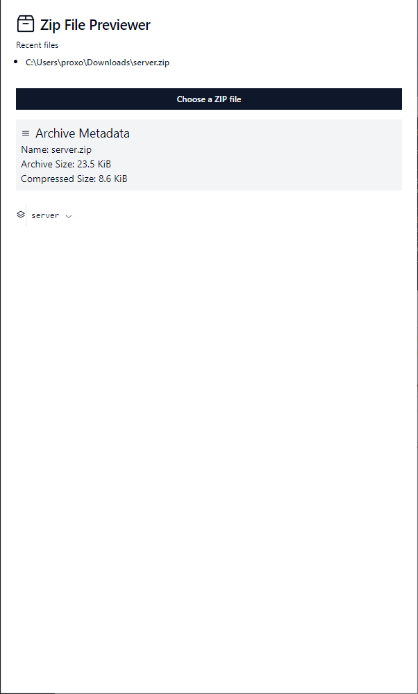
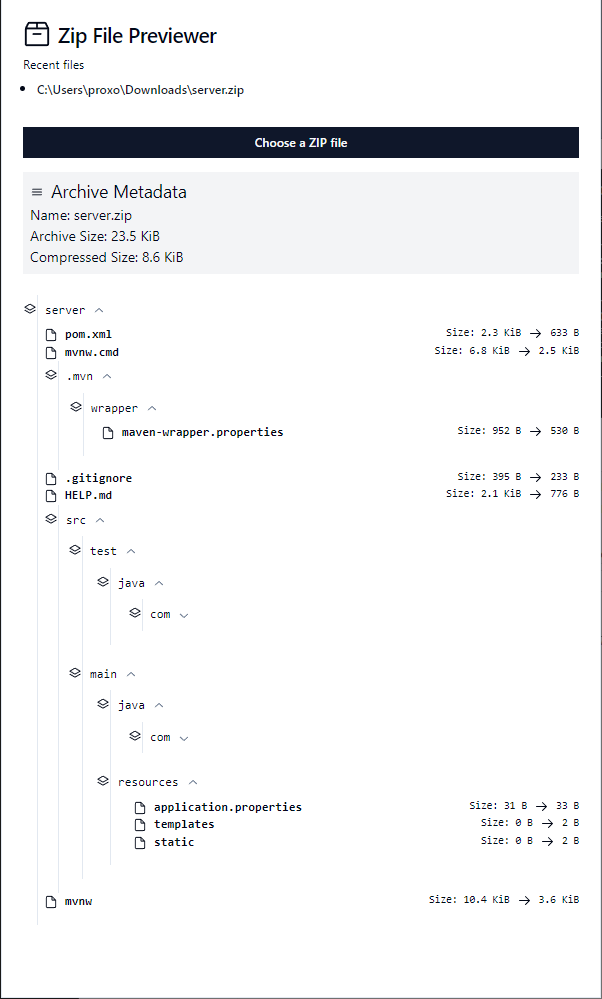
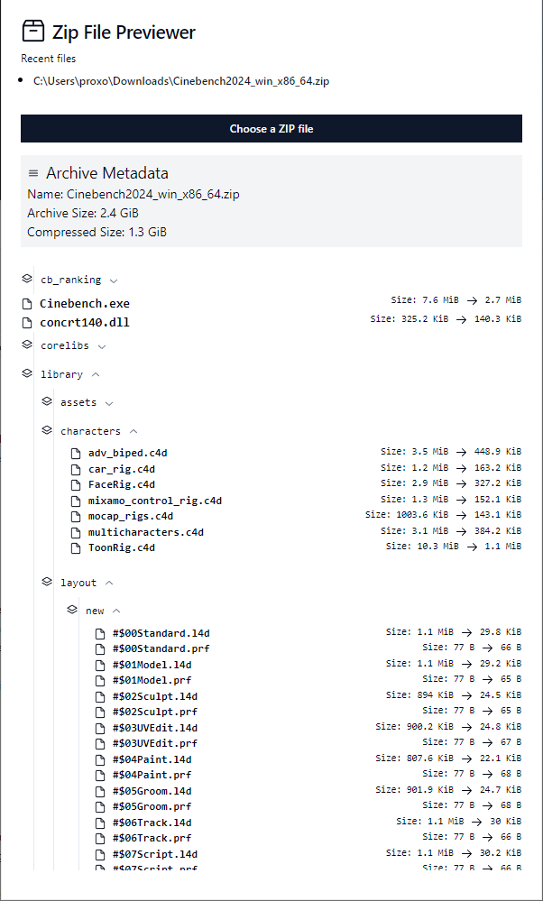

# Ferri

Preview zip files in your system!

## Overview

**Ferri** is a zip file previewer written in [Rust](https://www.rust-lang.org/) and the [Tauri](https://tauri.app/) framework with a [React](https://reactjs.org/) and [TypeScript](https://www.typescriptlang.org/) front end. Ferri provides efficient way to preview the contents of zip files without extracting them. It is designed to be fast, lightweight, and cross-platform.

## Features

- Built with Rust and Tauri, Ferri runs efficiently on various operating systems including Windows, macOS, and Linux.
- Reproducible development environment using [devenv](https://devenv.sh/) and [Nix](https://nixos.org/).
- Minimal resource usage for quick load times and responsive UI.
- Clean user interface built with React and TypeScript, styled using [TailwindCSS](https://tailwindcss.com/).

## Screenshots

### Home Page

The main dashboard

<div align="center">
    
</div>

### Collapsed Zip File Preview

A view showing the collapsed state of the zip file contents to see the structure at a glance.

<div align="center">
    
</div>

### File Explorer

An expanded view of the zip file contents.

<div align="center">
    
</div>

### Large File Explorer

Handling highly nested files using a scrollable area.

<div align="center">
    
</div>

## Development Environment

Ferri's development environment is powered by [devenv](https://devenv.sh/) and [Nix](https://nixos.org/).

### Getting Started

1. **Activate Developer Environment**:
   ```sh
   devenv shell
   ```
2. **Start Processes**:
   ```sh
   devenv up
   ```

### Prerequisites

Ensure you have the Nix package manager installed. Follow the [getting started guide](https://devenv.sh/getting-started/) if you need help installing Nix. Learn more about Nix and its benefits for creating reproducible, declarative, and reliable systems at [nixos.org](https://nixos.org/).

### Notes

1. Using `url: github:NixOS/nixpkgs/nixpkgs-unstable` instead of `url: github:cachix/devenv-nixpkgs/rolling` in `devenv.yaml` to resolve package version mismatches.
2. If you encounter screen artifacts due to version mismatches, run the app with:
   ```sh
   WEBKIT_DISABLE_COMPOSITING_MODE=1 pnpm dev
   ```
